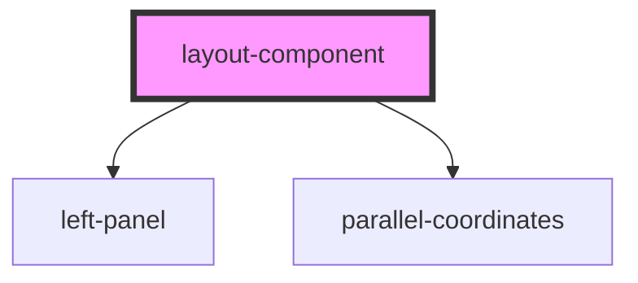

# my-component

<!-- Auto Generated Below -->

## Properties

| Property          | Attribute          | Description                                                                 | Type     | Default     |
| ----------------- | ------------------ | --------------------------------------------------------------------------- | -------- | ----------- |
| `dataUrl`         | `data-url`         |                                                                             | `string` | `undefined` |
| `last`            | `last`             | The last name                                                               | `string` | `undefined` |
| `selectedDataset` | `selected-dataset` | DataSet which needs to be poured in the visualization, can be a url to file | `any`    | `undefined` |
| `singleData`      | `single-data`      | Single data to plot on the graph                                            | `string` | `undefined` |

## Dependencies

### Depends on

- [left-panel](../panel-1)
- [parallel-coordinates](../parallel-coordinates)

### Graph

----------------------------------------------

*Built with [StencilJS](https://stenciljs.com/)*
