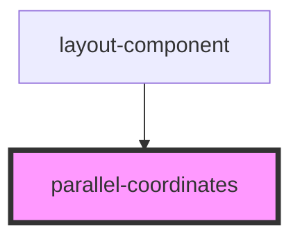

# parallel-coordinates

<!-- Auto Generated Below -->

## Properties

| Property       | Attribute     | Description | Type       | Default     |
| -------------- | ------------- | ----------- | ---------- | ----------- |
| `completedata` | --            |             | `Object[]` | `undefined` |
| `dataUrl`      | `data-url`    |             | `any`      | `undefined` |
| `singleData`   | `single-data` |             | `string`   | `undefined` |

## Dependencies

### Used by

 - [layout-component](../my-component)

### Graph

----------------------------------------------

*Built with [StencilJS](https://stenciljs.com/)*
